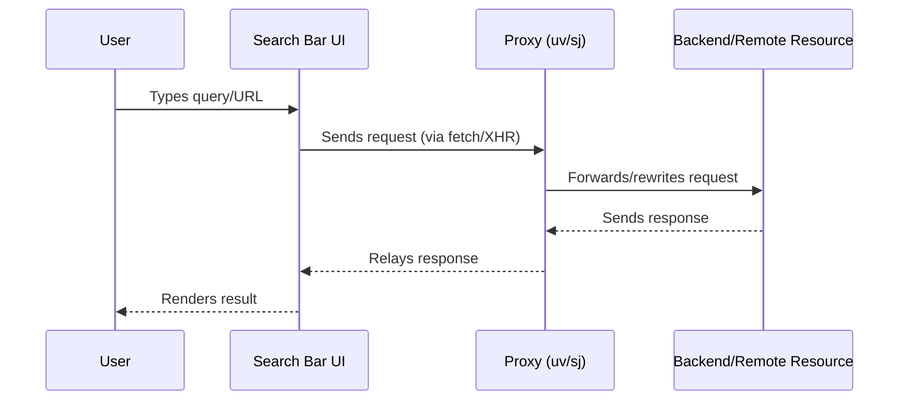
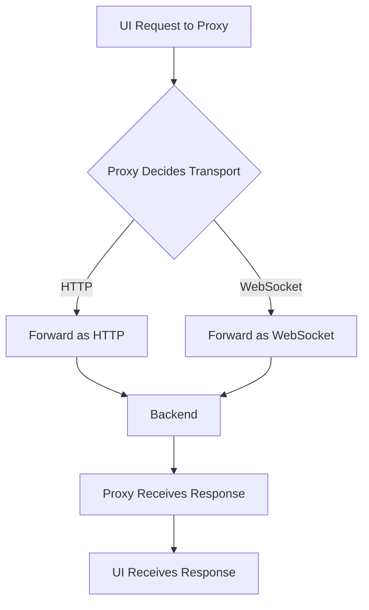
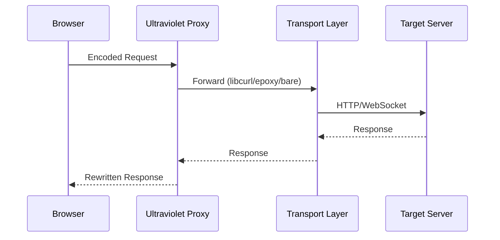
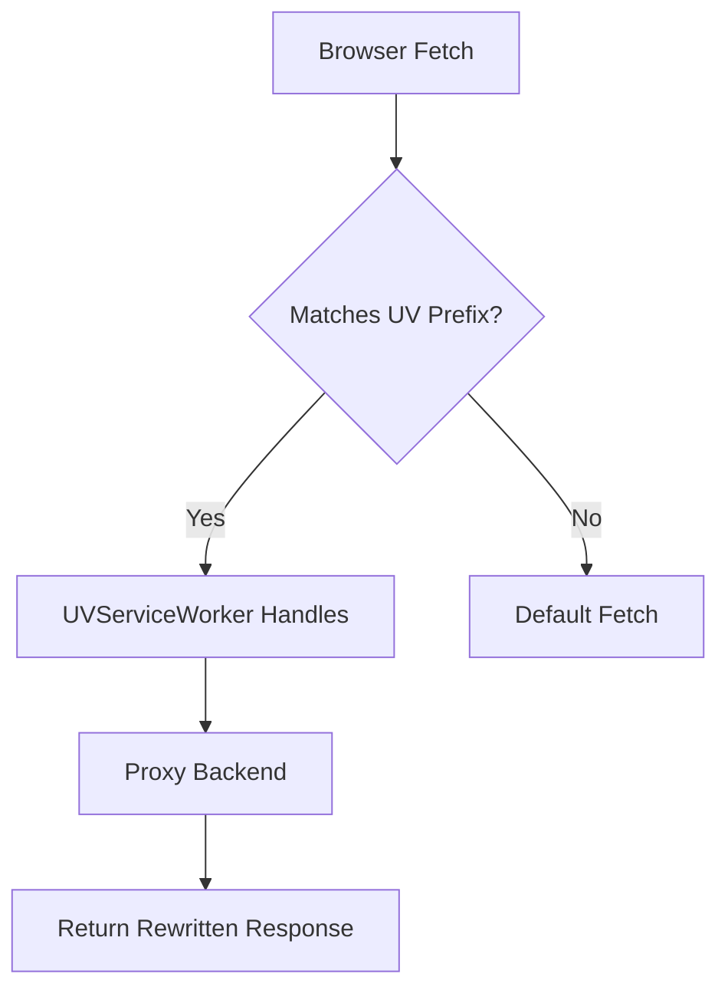
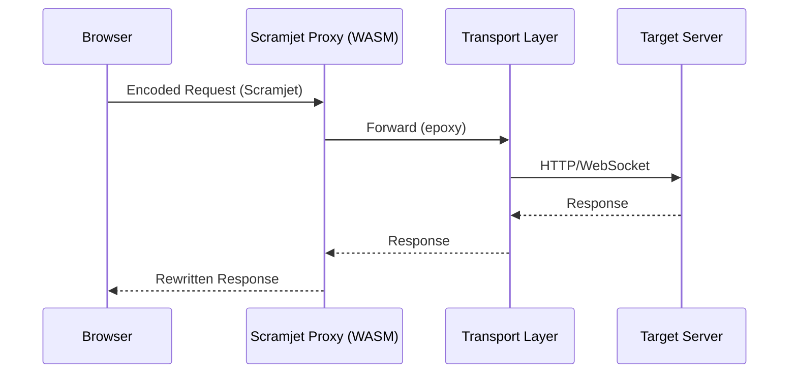

# Web Proxy, Backend, and Service Worker Architecture (Ultraviolet & Scramjet)

This document provides a comprehensive, in-depth explanation of how the search bar UI, proxy system, backend, and service workers interact in both Ultraviolet (UV) and Scramjet (SJ) web proxies. It covers the full flow from user input to backend response, with technical details, diagrams, and backend internals.

---

## Table of Contents
- [Overview: UI to Backend Flow](#overview-ui-to-backend-flow)
- [Step-by-Step Walkthrough](#step-by-step-walkthrough)
- [Key Concepts: Transports](#key-concepts-transports)
- [Ultraviolet (UV) In-Depth Backend & Service Worker](#ultraviolet-uv-in-depth-backend--service-worker)
- [Scramjet (SJ) In-Depth Backend & Service Worker](#scramjet-sj-in-depth-backend--service-worker)
- [Comparison Table](#comparison-table)

---

## Overview: UI to Backend Flow

- **Search Bar UI**: Where users type queries or URLs.
- **Proxy System (`uv` and `sj`)**: Middleware that intercepts, modifies, and forwards requests between the UI and the backend.
- **Backend**: The server or remote resource that ultimately processes the request.
- **Transports**: Mechanisms used by the proxy to relay requests and responses between the client and backend.

### High-Level Flow

---

## Step-by-Step Walkthrough

### 1. User Input
- User enters a search term or URL in the search bar.
- The UI captures the input and determines if it should be proxied (e.g., not a local command).

### 2. UI Sends Request
- The UI (JavaScript in `public/js/search.js`, `public/uv/search.js`, or `public/sj/search.js`) constructs a request.
- The request is sent to the proxy endpoint (e.g., `/uv/` or `/sj/`), often using `fetch`, `XMLHttpRequest`, or by setting an iframe's `src`.

### 3. Proxy Receives & Processes Request
- The proxy (`uv` or `sj`, see `public/uv/proxy.js` and `public/sj/index.js`) intercepts the request.
- It parses the incoming request, rewrites URLs, and applies any necessary headers or transformations.
- **Transports**: The proxy uses a transport layer (e.g., HTTP, WebSocket, libcurl, epoxy) to communicate with the backend. Transports abstract the details of how data is sent/received, allowing the proxy to support different protocols or optimize performance.
    - **Purpose**: Hide client IP, bypass restrictions, or add features (e.g., content filtering).
    - **How**: The proxy may encode the original URL, manage cookies, and handle CORS.

### 4. Backend Handling
- The backend (remote server or resource) receives the request as if it came from the proxy.
- It processes the request and sends a response (HTML, JSON, etc.) back to the proxy.

### 5. Proxy Relays Response
- The proxy receives the backend response.
- It may modify the response (e.g., rewrite URLs, inject scripts, strip headers).
- The response is sent back to the UI.

### 6. UI Renders Result
- The UI receives the response and renders it in the browser (e.g., displays a web page, search results, or error message).

---

## Key Concepts: Transports

- **Definition**: Abstractions for how the proxy communicates with the backend (e.g., HTTP, WebSocket, custom protocols).
- **Purpose**: Enable flexible, secure, and efficient data transfer; support for different backend types.
- **Implementation**: The proxy chooses a transport based on the request type, destination, or configuration. UV supports multiple transports (libcurl, epoxy, bareasmodule); SJ typically uses epoxy.

---

## Ultraviolet (UV) In-Depth Backend & Service Worker

### UV Backend Architecture (Deep Dive)

- **Proxy Core**: Ultraviolet’s backend is a modular JavaScript engine that acts as a full-featured HTTP(S) proxy. Its main responsibilities are:
  - Parsing incoming requests from the browser, decoding the encoded URL, and reconstructing the original target URL.
  - Rewriting request headers (e.g., User-Agent, Referer, Origin) to mask the client and ensure compatibility with the target server.
  - Managing cookies: intercepting, rewriting, and storing cookies in a way that isolates sessions per user and per proxied domain.
  - Handling CORS: rewriting CORS headers to allow cross-origin requests from the proxy’s own origin.
  - Injecting scripts or modifying HTML responses to ensure that all subsequent resource requests (JS, CSS, images, XHR) are routed back through the proxy.
  - Stripping or rewriting security headers (CSP, X-Frame-Options, etc.) to prevent the browser from blocking proxied content.
  - Logging and error handling: capturing errors at every stage, providing detailed error messages to the client, and optionally logging for analytics or debugging.

- **Request Lifecycle**:
  1. **Reception**: The backend receives a request at a special endpoint (e.g., `/uv/service/ENCODED_URL`).
  2. **Decoding**: The encoded URL is decoded using the configured codec (default: XOR), restoring the original destination.
  3. **Header Rewriting**: The backend rewrites headers to anonymize the client and ensure compatibility. This includes spoofing the User-Agent, removing or modifying Referer/Origin, and handling Accept/Accept-Language.
  4. **Transport Selection**: Based on configuration or runtime logic, the backend selects a transport (libcurl, epoxy, bareasmodule) to forward the request. Each transport is a pluggable module that abstracts the network layer.
  5. **Forwarding**: The request is sent to the target server using the selected transport. The backend manages connection pooling, timeouts, and retries for robustness.
  6. **Response Handling**: The backend receives the response, rewrites URLs in the body (HTML, JS, CSS), rewrites or strips headers, and manages cookies. It may also inject scripts for further proxying or analytics.
  7. **Error Handling**: If an error occurs (network, DNS, timeout, etc.), the backend generates a detailed error page with diagnostic info for the user.
  8. **Return**: The rewritten response is sent back to the browser.

- **Internal Modules**:
  - **Codec Module**: Handles encoding/decoding of URLs and sometimes payloads.
  - **Transport Modules**: Each transport (libcurl, epoxy, bareasmodule) is implemented as a separate module, allowing for easy extension or replacement.
  - **Header Rewriter**: Central logic for rewriting, stripping, or injecting headers.
  - **Cookie Jar**: Manages cookies per user/session, ensuring isolation and privacy.
  - **HTML/JS Rewriter**: Parses and rewrites HTML/JS/CSS to ensure all resource URLs are proxied.
  - **Error Handler**: Generates user-friendly error pages and logs errors for debugging.

- **Security & Privacy**:
  - All requests are anonymized; the target server never sees the real client IP or headers.
  - Cookies are isolated per user and per proxied domain.
  - Security headers are managed to prevent browser blocks but can be configured for stricter policies.
  - The backend can optionally log requests for analytics, but this is configurable for privacy.

- **Extensibility**:
  - New transports can be added by implementing the transport interface.
  - Middleware can be inserted for analytics, content filtering, or custom header logic.
  - The backend is designed to be modular, making it easy to extend or customize for different deployment scenarios.

- **Error Handling**:
  - All errors (network, DNS, protocol, etc.) are caught and surfaced to the user with detailed diagnostics.
  - The backend can distinguish between client-side and server-side errors, and optionally retry or fallback to alternate transports.

- **Example Internal Flow**:
  - User requests `/uv/service/ENCODED_URL` → Decode URL → Rewrite headers → Select transport → Forward request → Receive response → Rewrite body/headers → Return to client.

#### Mermaid: UV Backend Flow

#### Technical Details

- **Request Encoding**: The UV proxy encodes URLs using a prefix and XOR codec, e.g., `/uv/service/` + encoded URL. This prevents direct access and helps bypass network filters.
- **Transport Selection**: The proxy can dynamically switch between transports (libcurl, epoxy, bareasmodule) for optimal performance or compatibility. Each transport is a module that handles the low-level networking.
- **BareMux**: Acts as a multiplexer, allowing the proxy to route requests through different worker scripts or transports. This enables advanced features like load balancing or failover.
- **Header Rewriting**: The proxy strips or rewrites security headers (CSP, X-Frame-Options, etc.) to ensure proxied content loads and functions correctly in the browser.
- **Cookie Management**: Cookies are managed and rewritten to maintain session integrity while hiding the user's identity from the target server.

### UV Service Worker Role

- **Purpose**: Intercepts browser requests and routes them through the UV proxy, enabling seamless proxying and content rewriting.
- **How it works**:
  - The service worker (`uv.sw.js` or `sw.js`) is registered on page load (see `register-sw.js`).
  - On each `fetch` event, it checks if the request matches the UV proxy prefix.
  - If so, it uses the `UVServiceWorker` to handle the request (decode, rewrite, forward, and respond).
  - Otherwise, it falls back to the default network fetch.
- **Security**: Strips or rewrites security headers to avoid browser restrictions and ensure proxied content loads correctly.
- **Integration**: The service worker loads the UV bundle and config, and instantiates a `UVServiceWorker` to handle routing and fetch logic.

#### Mermaid: UV Service Worker Flow

---

## Scramjet (SJ) In-Depth Backend & Service Worker

### SJ Backend Architecture (Deep Dive)

- **Proxy Core**: Scramjet’s backend is a high-performance, modular proxy engine built on WebAssembly (WASM). Its main responsibilities are:
  - Decoding incoming requests from the browser, reconstructing the original target URL using Scramjet’s encoding.
  - Rewriting and anonymizing request headers, including User-Agent, Referer, and Origin, to mask the client and ensure compatibility.
  - Managing cookies in a secure, isolated fashion, ensuring that each user and proxied domain has its own cookie context.
  - Handling CORS by rewriting headers to allow cross-origin requests from the proxy’s origin.
  - Parsing and rewriting HTML, JS, and CSS responses to ensure all resource URLs are routed through the proxy.
  - Stripping or rewriting security headers to prevent browser blocks and ensure proxied content loads correctly.
  - Leveraging WASM for low-level, high-speed networking and data processing, making it suitable for heavy or complex workloads.
  - Providing detailed error handling and diagnostics, surfacing issues to the user and logging for debugging.

- **Request Lifecycle**:
  1. **Reception**: The backend receives a request at a Scramjet endpoint (e.g., `/sj/service/ENCODED_URL`).
  2. **Decoding**: The encoded URL is decoded using Scramjet’s WASM logic, restoring the original destination.
  3. **Header Rewriting**: Headers are rewritten to anonymize the client and ensure compatibility. This includes spoofing User-Agent, removing or modifying Referer/Origin, and handling Accept/Accept-Language.
  4. **Transport Selection**: The backend selects a transport (typically epoxy, but extensible) to forward the request. Each transport is a WASM or JS module that abstracts the network layer.
  5. **Forwarding**: The request is sent to the target server using the selected transport. The backend manages connection pooling, timeouts, and retries for robustness.
  6. **Response Handling**: The backend receives the response, rewrites URLs in the body (HTML, JS, CSS), rewrites or strips headers, and manages cookies. It may also inject scripts for further proxying or analytics.
  7. **Error Handling**: If an error occurs (network, DNS, timeout, etc.), the backend generates a detailed error page with diagnostic info for the user.
  8. **Return**: The rewritten response is sent back to the browser.

- **Internal Modules**:
  - **WASM Core**: Handles decoding, encoding, and high-speed networking.
  - **Transport Modules**: Each transport (epoxy, etc.) is implemented as a WASM or JS module, allowing for easy extension or replacement.
  - **Header Rewriter**: Central logic for rewriting, stripping, or injecting headers.
  - **Cookie Jar**: Manages cookies per user/session, ensuring isolation and privacy.
  - **HTML/JS Rewriter**: Parses and rewrites HTML/JS/CSS to ensure all resource URLs are proxied.
  - **Error Handler**: Generates user-friendly error pages and logs errors for debugging.

- **Security & Privacy**:
  - All requests are anonymized; the target server never sees the real client IP or headers.
  - Cookies are isolated per user and per proxied domain.
  - Security headers are managed to prevent browser blocks but can be configured for stricter policies.
  - The backend can optionally log requests for analytics, but this is configurable for privacy.

- **Extensibility**:
  - New transports can be added by implementing the transport interface in WASM or JS.
  - Middleware can be inserted for analytics, content filtering, or custom header logic.
  - The backend is designed to be modular, making it easy to extend or customize for different deployment scenarios.

- **Error Handling**:
  - All errors (network, DNS, protocol, etc.) are caught and surfaced to the user with detailed diagnostics.
  - The backend can distinguish between client-side and server-side errors, and optionally retry or fallback to alternate transports.

- **Example Internal Flow**:
  - User requests `/sj/service/ENCODED_URL` → Decode URL (WASM) → Rewrite headers → Select transport → Forward request → Receive response → Rewrite body/headers → Return to client.

#### Mermaid: SJ Backend Flow

#### Technical Details

- **WASM Acceleration**: Scramjet leverages WebAssembly for high-performance, low-level networking and data processing, making it more efficient than pure JavaScript proxies for certain workloads.
- **Request Encoding**: Scramjet encodes URLs and request data using its own method, providing obfuscation and compatibility with the WASM backend.
- **Transport Layer**: Typically uses the `epoxy` transport, but can be extended for other protocols. The transport handles the actual network communication with the target server.
- **BareMux**: Provides multiplexing and dynamic routing, similar to UV, allowing for advanced networking features and failover.
- **Header & Cookie Management**: Like UV, Scramjet rewrites headers and manages cookies to maintain session integrity and privacy.

### SJ Service Worker Role

- **Purpose**: Ensures all requests from the browser are routed through the Scramjet proxy, enabling WASM-powered request handling and content rewriting.
- **How it works**:
  - The service worker (`sw.js`) is registered via `registerSJSW()` (see `public/sj/register-sw.js`).
  - On each request, it can intercept and route through Scramjet logic (if implemented in the SW).
  - Ensures HTTPS or localhost for service worker registration due to browser security policies.
- **Integration**: The service worker is tightly coupled with the ScramjetController and WASM logic, enabling advanced proxy features in-browser.

---

## Comparison Table

| Feature                | Ultraviolet (UV)         | Scramjet (SJ)           |
|------------------------|-------------------------|-------------------------|
| Proxy Engine           | JavaScript (Ultraviolet)| WASM (Scramjet)         |
| Transport Support      | libcurl, epoxy, bare    | epoxy                   |
| URL Encoding           | XOR codec               | Scramjet encodeUrl      |
| Service Worker         | uv.sw.js/sw.js          | sw.js                   |
| Multiplexing           | BareMux                 | BareMux                 |
| Backend Rewriting      | Yes                     | Yes                     |
| WASM Acceleration      | No                      | Yes                     |

---

*For further details, see the relevant files in `public/uv/` and `public/sj/`.*
