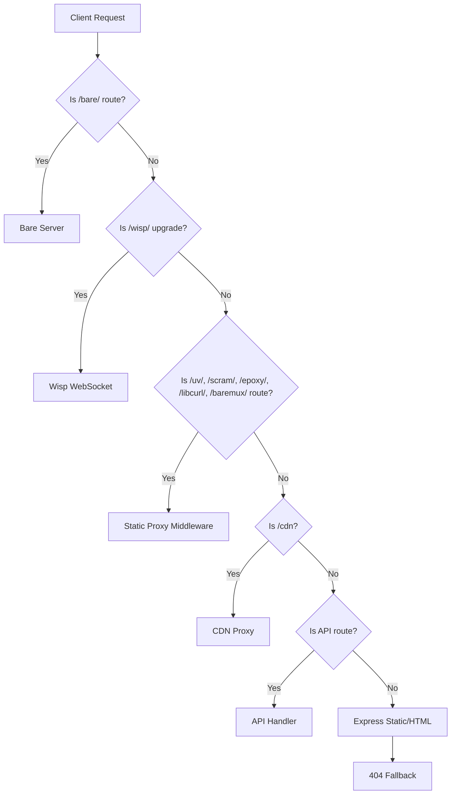
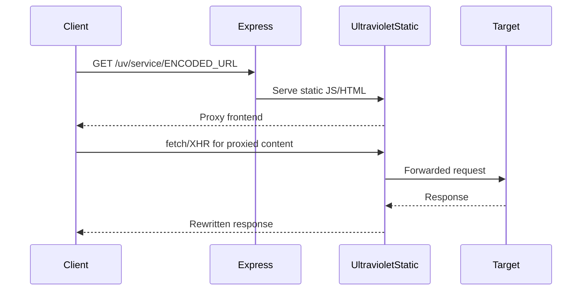
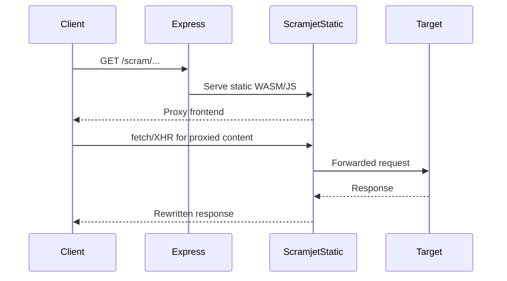
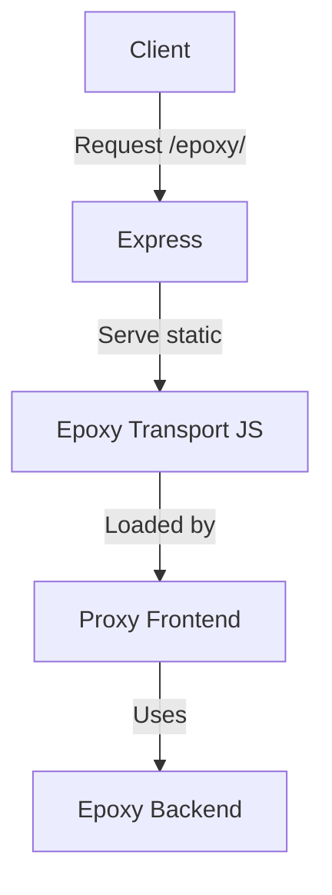
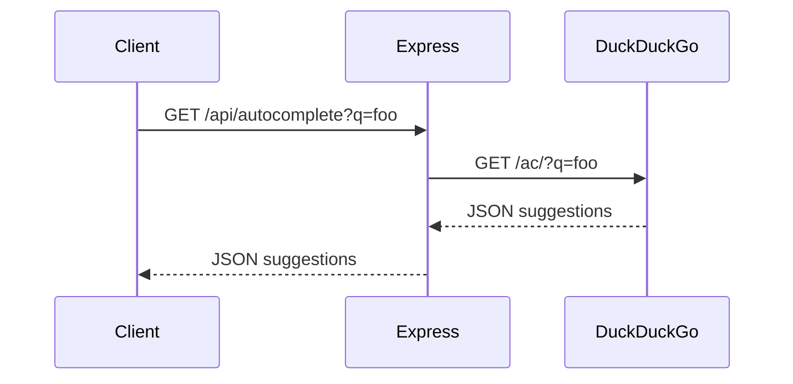
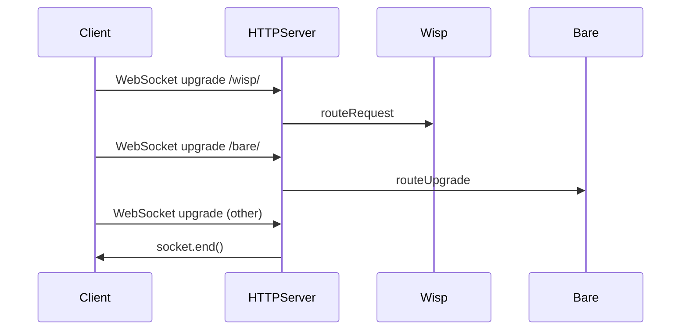

# Server-Side Architecture: `index.js` Deep Dive

This document provides an in-depth, technical walkthrough of how `index.js` orchestrates communication between the Express server, various proxy backends (Ultraviolet, Scramjet, Bare, Epoxy, Libcurl, BareMux), static assets, and the client. It includes detailed explanations, request/response lifecycles, and multiple Mermaid diagrams to illustrate the flow.

---

## Table of Contents
- [Overview](#overview)
- [Key Components](#key-components)
- [Request Routing: High-Level Flow](#request-routing-high-level-flow)
- [Detailed Request Lifecycle](#detailed-request-lifecycle)
- [Proxy Integration](#proxy-integration)
  - [Ultraviolet](#ultraviolet)
  - [Scramjet](#scramjet)
  - [Bare, Epoxy, Libcurl, BareMux](#bare-epoxy-libcurl-baremux)
- [Static Asset Handling](#static-asset-handling)
- [API Endpoints](#api-endpoints)
- [WebSocket and Upgrade Handling](#websocket-and-upgrade-handling)
- [Error Handling and Fallbacks](#error-handling-and-fallbacks)
- [Shutdown and Lifecycle Management](#shutdown-and-lifecycle-management)

---

## Overview

`index.js` is the entry point for the Node.js server. It:
- Sets up an Express app for HTTP(S) requests.
- Integrates multiple proxy backends (Ultraviolet, Scramjet, Bare, Epoxy, Libcurl, BareMux) for advanced web proxying.
- Serves static assets and HTML pages.
- Handles API endpoints for autocomplete, version, and commit info.
- Manages WebSocket upgrades for Wisp and Bare.
- Provides robust error handling and graceful shutdown.

---

## Key Components

- **Express App**: Handles routing, static files, and API endpoints.
- **Proxy Backends**: Middleware for Ultraviolet, Scramjet, Bare, Epoxy, Libcurl, BareMux.
- **CDN Proxy**: Forwards `/cdn` requests to an external CDN.
- **Bare Server**: Handles low-level HTTP(S) proxying for `/bare/` routes.
- **Wisp**: Handles WebSocket upgrades for `/wisp/`.
- **API Endpoints**: `/api/autocomplete`, `/api/version`, `/api/commit`.
- **Static Asset Serving**: Serves HTML, JS, CSS, and service worker files.
- **Error Handling**: Catches and responds to errors, including 404s.

---

## Request Routing: High-Level Flow

---

## Detailed Request Lifecycle

### 1. **Initial HTTP Request**
- The Node.js HTTP server receives a request.
- It checks if the request should be handled by the Bare server (for `/bare/` routes).
- If not, the request is passed to the Express app.

### 2. **Express Routing**
- Express parses the request and matches it against:
  - Static asset routes (HTML, JS, CSS, service workers)
  - Proxy middleware routes (`/uv/`, `/scram/`, `/epoxy/`, `/libcurl/`, `/baremux/`)
  - CDN proxy (`/cdn`)
  - API endpoints
  - Fallbacks (404, redirects)

### 3. **Proxy Middleware**
- For proxy routes, Express serves static files from the corresponding proxy backend’s public directory.
- Service worker routes are handled with special headers (e.g., `Service-Worker-Allowed`).

### 4. **API Handling**
- `/api/autocomplete`: Forwards query to DuckDuckGo, returns JSON.
- `/api/version`: Returns version from `package.json`.
- `/api/commit`: Returns current git commit hash.

### 5. **WebSocket/Upgrade Handling**
- For `/wisp/` upgrades, the Wisp server handles the WebSocket handshake.
- For `/bare/` upgrades, the Bare server handles the connection.

### 6. **Fallbacks and Errors**
- Unmatched routes fall back to serving `404.html`.
- Errors are caught and returned as JSON or HTML as appropriate.

---

## Proxy Integration

### Ultraviolet
- **Static Middleware**: `app.use("/uv/", express.static(uvPath));`
- **How it works**: Requests to `/uv/` are served from the Ultraviolet public directory, which contains the client-side proxy logic and service worker scripts.
- **Lifecycle**:
  1. Client requests `/uv/service/ENCODED_URL`.
  2. Express serves the static JS/HTML for the proxy frontend.
  3. The frontend JS (Ultraviolet) encodes/decodes URLs and communicates with the backend via fetch/XHR.
  4. Service workers intercept and route requests as needed.

### Scramjet
- **Static Middleware**: `app.use("/scram/", express.static(scramjetPath));`
- **How it works**: Requests to `/scram/` are served from the Scramjet public directory, which includes WASM and JS for the Scramjet proxy engine.
- **Lifecycle**:
  1. Client requests `/scram/` assets or endpoints.
  2. Express serves the static WASM/JS for the Scramjet frontend.
  3. The frontend JS (ScramjetController) encodes/decodes URLs and communicates with the backend via fetch/XHR.
  4. Service workers and WASM logic handle request routing and proxying.

### Bare, Epoxy, Libcurl, BareMux
- **Static Middleware**: Each has its own static route (e.g., `/bareasmodule/`, `/epoxy/`, `/libcurl/`, `/baremux/`).
- **How it works**: These provide additional transport backends for the proxies, served as static assets or worker scripts.
- **Integration**: The frontend proxy logic (Ultraviolet or Scramjet) dynamically selects and loads these transports as needed.

---

## Static Asset Handling
- The client is built with Vite into `dist/` (multi-page: home, settings, go, 404) and served by Express.
- During development, Vite serves assets with HMR; in production, Express reads from `dist/` (override with `STATIC_DIR` if needed).
- Proxy/static artifacts (Ultraviolet, Scramjet, etc.) are still served from their dedicated routes and copied from `public/` during the build.
- Special handling for service worker files (e.g., `/sj/sw.js`) to set correct headers.

---

## API Endpoints
- `/api/autocomplete`: Proxies search suggestions from DuckDuckGo.
- `/api/version`: Returns the current version from `package.json`.
- `/api/commit`: Returns the current git commit hash.

---

## WebSocket and Upgrade Handling
- The HTTP server listens for `upgrade` events (WebSocket handshakes).
- If the URL ends with `/wisp/`, the Wisp server handles the upgrade.
- If the request matches Bare, the Bare server handles the upgrade.
- Otherwise, the socket is closed.

---

## Error Handling and Fallbacks
- All unmatched routes fall back to serving `404.html`.
- API errors are caught and returned as JSON with error messages.
- The server logs errors and can be extended for more advanced monitoring.

---

## Shutdown and Lifecycle Management
- The server listens for `SIGINT` and `SIGTERM` to gracefully shut down.
- Closes HTTP and Bare servers, then exits the process.

---

## Summary

`index.js` acts as the central orchestrator, routing requests to the correct proxy backend, serving static assets, handling API endpoints, and managing WebSocket upgrades. Its modular design allows for easy integration of new proxy backends and transports, making it a flexible foundation for advanced web proxying and static site serving.

---

*For further details, see the source code in `index.js` and the proxy backend directories.*
