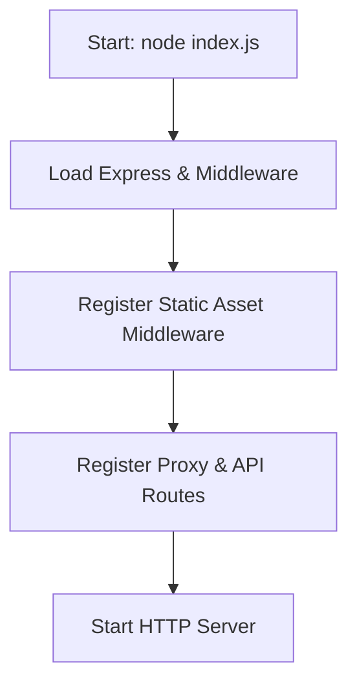
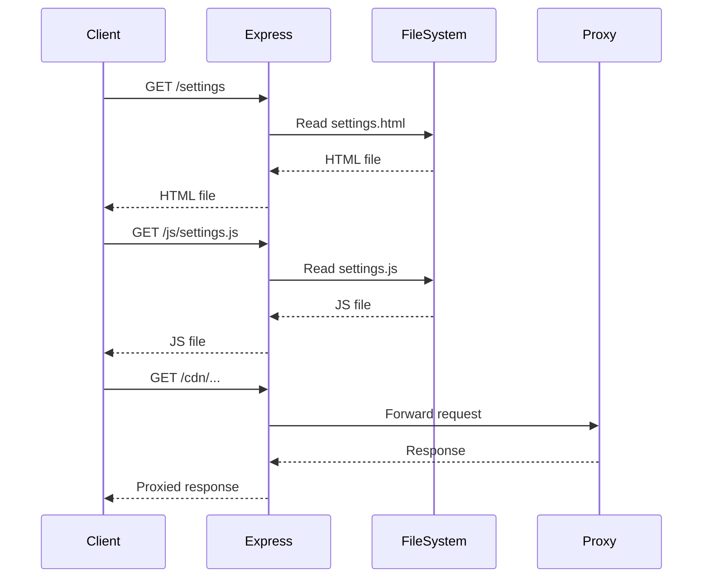
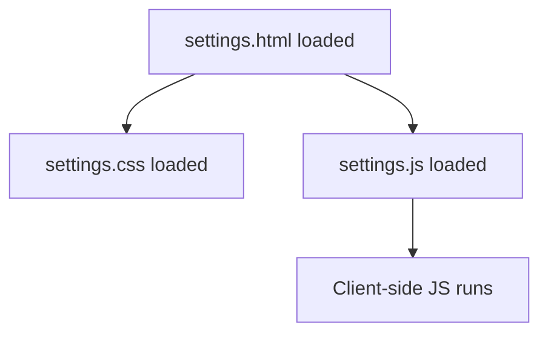

# Server vs. Client Load Order

**Order of operations:**

1. The server (`index.js`) runs first. It listens for incoming HTTP requests.
2. When a user visits the site, the server receives the request and serves `index.html` (or another HTML file).
3. The browser loads `index.html` and then loads all referenced scripts and assets.

**Summary:** The server must be running before any HTML or JS is loaded in the browser. The browser never "calls" `index.js` directly; it only receives files from it.
# SuperNova Site Load & Build Order

This document explains the order in which SuperNova loads and builds its files, from server startup to client-side asset loading. It also includes Mermaid diagrams for visual clarity.

---

## 1. Server Startup (Node.js/Express)

- The entry point is `index.js`.
- Loads all required modules and sets up Express middleware.
- Static assets are served from the built `dist/` directory (generated by Vite) with cache headers.
- Proxy backends and API endpoints are registered.

**Key Files Loaded at Startup:**
- `index.js` (main server logic)
- `package.json` (for version info)
- Proxy backend modules (e.g., `@mercuryworkshop/*`)
- Static files from `public/`

---

## 2. HTTP Request Handling

- Requests for static files (HTML, JS, CSS, images) are served from `dist/` (or `STATIC_DIR` if overridden).
- Requests for `/`, `/settings`, `/go`, etc. serve specific HTML files.
- API and proxy requests are routed to their handlers.

**Example Route Handling:**
- `/` → `dist/index.html`
- `/settings` → `dist/settings.html`
- `/go` → `dist/go.html`
- `/api/version` → returns version from `package.json`
- `/cdn` → proxied to external target

---

## 3. Client-Side Asset Loading

- The browser loads the main HTML file.
- HTML references JS, CSS, and other assets (with cache-busting if used).
- JS files initialize client-side logic and UI.

**Typical Load Order for `/settings`:**
1. `settings.html` (HTML built by Vite)
2. Hashed CSS emitted by Vite (from `src/styles/`)
3. Hashed JS bundle emitted by Vite (bootstraps `src/settings/main.js`)
4. Other JS/CSS/media copied from `public/` (e.g., proxy/service worker assets)

---

## 4. Build/Deploy Process

- Frontend is built with Vite (`pnpm build`), which outputs hashed assets to `dist/`.
- Deployment copies the repository (including `dist/`) and runs `pnpm start` to serve the built assets.
- `pnpm preview` can be used locally to verify the built output before deploying.

---

## Summary Table

| Step                | Main Files/Dirs                | Description                       |
|---------------------|-------------------------------|-----------------------------------|
| Server Startup      | `index.js`, `dist/`            | Loads server, sets up routes      |
| Static Asset Serve  | `dist/` (or `STATIC_DIR`)      | Serves HTML, JS, CSS, images      |
| API/Proxy Routing   | `index.js`, proxy modules      | Handles API and proxy requests    |
| Client Load         | built HTML/CSS/JS bundles      | Browser loads and runs assets     |

---

For more details, see the code comments in `index.js` and the `/dist` (build output) directory structure.
